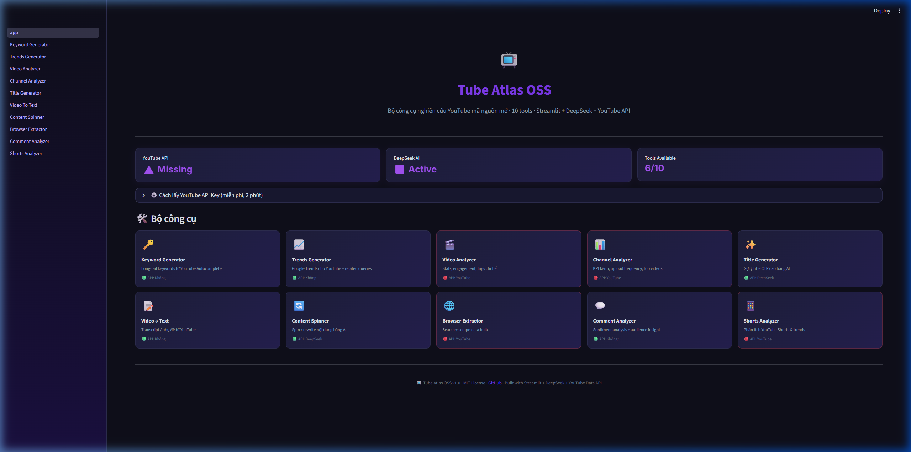
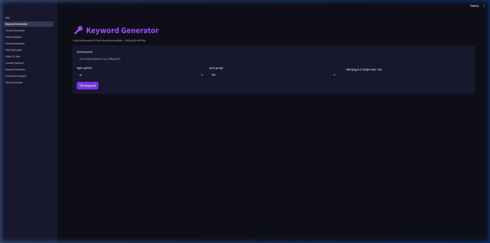
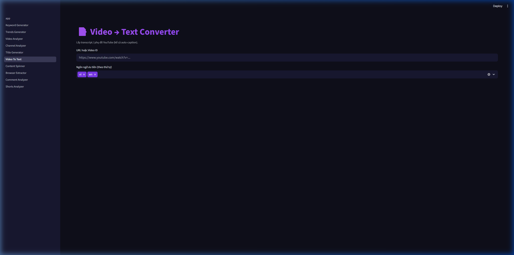

<div align="center">

# 📺 Tube Atlas OSS

**Bộ công cụ nghiên cứu YouTube mã nguồn mở — thay thế Tube Atlas Premium / VidIQ / TubeBuddy**

[](https://python.org)
[](https://streamlit.io)
[](LICENSE)
[](https://platform.deepseek.com)
[](https://github.com/quyenmanhnguyen/tube-atlas-oss/actions)
[](#-docker)


</div>

---

## 📸 Preview

<div align="center">

### Dashboard


### Keyword Generator (no API key needed!)


### Video → Text Converter


</div>

---

## ✨ Tính năng

| # | Tool | Mô tả | Cần API key? |
|---|---|---|---|
| 🔑 | **Keyword Generator** | Long-tail keywords từ YouTube Autocomplete | ❌ Free |
| 📈 | **Trends Generator** | Google Trends cho YouTube + related queries | ❌ Free |
| 🎬 | **Video Analyzer** | Stats, engagement, tags chi tiết | ✅ YouTube |
| 📊 | **Channel Analyzer** | KPI kênh, upload frequency, top videos | ✅ YouTube |
| ✨ | **Title Generator** | Gợi ý title CTR cao bằng AI | ✅ DeepSeek |
| 📝 | **Video → Text** | Transcript / phụ đề từ YouTube | ❌ Free |
| 🌀 | **Content Spinner** | Spin / rewrite nội dung bằng AI | ✅ DeepSeek |
| 🕸️ | **Browser Extractor** | Search + scrape data bulk | ✅ YouTube |
| 💬 | **Comment Analyzer** | Sentiment analysis + audience insight | ❌ Free* |
| 🩳 | **Shorts Analyzer** | Phân tích YouTube Shorts & trends | ✅ YouTube |
| 🩺 | **Channel Audit** | Chấm điểm kênh 0-100 + recommendations | ✅ YouTube |
| 🔥 | **Niche Pulse** | Briefing song song YT + Trends + Autocomplete + AI cho 1 topic trong 30 ngày | ✅ YouTube |
| 🕵️ | **Competitor Discovery** | Auto tìm top 5 kênh đối thủ cùng niche | ✅ YouTube |

> **6/13 tools hoạt động ngay** mà không cần API key nào!

### ✨ v1.2 highlights (mượn ý từ `/last30days-skill` + `agent-reach`)

- **🔥 Niche Pulse** (page mới): quét **song song** YouTube (last 30d) + Google Trends + YouTube Autocomplete + top comments → DeepSeek tổng hợp briefing 5 mục (nhiệt độ chủ đề, format viral, keyword emerging, sentiment, 3 ý tưởng video). Cảm hứng từ [`/last30days-skill`](https://github.com/mvanhorn/last30days-skill) (24k⭐).
- **🕵️ Competitor Discovery** (page mới): nhập 1 kênh seed → auto extract keywords top → song song search → rank top N kênh đối thủ cùng niche.
- **🖥️ CLI `tube-atlas`** (cảm hứng `agent-reach`):
  - `tube-atlas doctor` — check env + API probe + cache + deps
  - `tube-atlas niche "review iphone 17" --days 30` — briefing ra markdown
  - `tube-atlas audit @MrBeast` — chấm điểm kênh 0-100
  - `tube-atlas competitors @MrBeast -n 5`
  - `--json` flag cho mọi command, dễ pipe vào agent
- **🧩 Claude Skill** (`skills/tube-atlas/SKILL.md`): dùng được trong Claude Code / Cursor / Gemini CLI qua CLI ở trên.

### ✨ v1.1 highlights (VidIQ-parity features)

- **⚡ Outlier Score** trong Channel Analyzer: flag video viral của competitor (`views/median(channel)` ≥5x = 🔥 viral, 2-5x = 📈 trên TB)
- **⏰ Best Time to Post**: phân tích top videos → gợi ý ngày + giờ post tốt nhất (giờ VN UTC+7)
- **🩺 Channel Audit**: chấm điểm kênh 0-100 trên 5 tiêu chí (upload frequency, engagement, tags coverage, title length, thumbnail HD) + recommendations cụ thể
- **💾 SQLite cache** cho YouTube API → tiết kiệm 5-10x quota khi mở lại cùng kênh / search
- **📝 Video→Text fallback**: tự động chuyển sang `yt-dlp` nếu `youtube-transcript-api` bị chặn IP (cloud env)

---

## 🚀 Cài đặt

```bash
# Clone repo
git clone https://github.com/quyenmanhnguyen/tube-atlas-oss.git
cd tube-atlas-oss

# Cài dependencies
pip install -r requirements.txt

# Cấu hình API keys
cp .env.example .env
# Sửa .env → thêm YOUTUBE_API_KEY và DEEPSEEK_API_KEY

# Chạy dashboard
streamlit run app.py

# Hoặc dùng CLI
pip install -e .
tube-atlas doctor
tube-atlas niche "review iphone 17" --days 30
tube-atlas audit @MrBeast
```

Mở browser tại **http://localhost:8501** 🎉

---

## 🖥️ CLI

Sau `pip install -e .` bạn có lệnh `tube-atlas` trong PATH:

```bash
tube-atlas doctor                              # health check env + API
tube-atlas niche "AI agent" --days 30          # briefing 30 ngày
tube-atlas niche "crypto" --json --no-llm      # raw JSON cho agent
tube-atlas audit @MrBeast --limit 100          # chấm kênh 0-100
tube-atlas competitors @MrBeast -n 5 --json    # top 5 đối thủ
tube-atlas cache stats                         # SQLite cache stats
```

Dùng được trong **Claude Code / Cursor / Gemini CLI** thông qua
[`skills/tube-atlas/SKILL.md`](skills/tube-atlas/SKILL.md).

---

## 🐳 Docker

```bash
docker build -t tube-atlas-oss .
docker run -p 8501:8501 --env-file .env tube-atlas-oss
```

---

## ☁️ Deploy lên Streamlit Cloud (free)

1. Fork repo này
2. Vào [share.streamlit.io](https://share.streamlit.io) → Connect GitHub
3. Chọn repo `tube-atlas-oss` → Main file: `app.py`
4. Advanced settings → Secrets:
   ```toml
   YOUTUBE_API_KEY = "AIza..."
   DEEPSEEK_API_KEY = "sk-..."
   ```
5. Click Deploy → có URL public trong ~2 phút

---

## 🔑 Lấy API Keys

### YouTube Data API v3 (miễn phí — 10,000 units/ngày)

1. Vào [Google Cloud Console](https://console.cloud.google.com/apis/credentials)
2. Tạo Project → Enable **YouTube Data API v3**
3. Credentials → Create → **API key**
4. Dán vào `.env`: `YOUTUBE_API_KEY=AIza...`

### DeepSeek API

1. Vào [platform.deepseek.com](https://platform.deepseek.com/api_keys)
2. Tạo API key
3. Dán vào `.env`: `DEEPSEEK_API_KEY=sk-...`

---

## 📊 Quota YouTube API

| Endpoint | Cost/call | Ước tính/ngày |
|---|---|---|
| `search.list` | 100 units | ~100 lần search |
| `videos.list` (50 ID) | 1 unit | ~10,000 video lookup |
| `channels.list` | 1 unit | ~10,000 kênh |
| `commentThreads.list` | 1 unit | ~10,000 lần |

---

## 🛠️ Stack

| Layer | Tech |
|---|---|
| Frontend | [Streamlit](https://streamlit.io) (multi-page, dark theme) |
| YouTube API | [google-api-python-client](https://github.com/googleapis/google-api-python-client) |
| Transcript | [youtube-transcript-api](https://github.com/jdepoix/youtube-transcript-api) (7.3k★) |
| Comments | [youtube-comment-downloader](https://github.com/egbertbouman/youtube-comment-downloader) |
| Trends | [pytrends](https://github.com/GeneralMills/pytrends) (`gprop='youtube'`) |
| Sentiment | [vaderSentiment](https://github.com/cjhutto/vaderSentiment) |
| AI | [DeepSeek](https://platform.deepseek.com) via OpenAI SDK |
| Container | [Docker](https://www.docker.com/) |

---

## 📁 Cấu trúc

```
tube-atlas-oss/
├── .env.example          # Template API keys
├── .github/
│   └── workflows/
│       └── ci.yml        # Ruff lint + syntax check
├── .streamlit/
│   └── config.toml       # Dark premium theme
├── Dockerfile            # Docker container
├── app.py                # Dashboard chính
├── core/
│   ├── autocomplete.py   # YouTube keyword suggestions
│   ├── comments.py       # Comment downloader (no API key)
│   ├── llm.py            # DeepSeek integration
│   ├── theme.py          # Premium CSS module
│   ├── transcript.py     # YouTube transcript (no API key)
│   ├── trends.py         # pytrends YouTube
│   ├── utils.py          # Helpers
│   └── youtube.py        # YouTube Data API v3 wrapper
├── pages/                # 10 Streamlit pages
│   ├── 1_Keyword_Generator.py
│   ├── 2_Trends_Generator.py
│   ├── ...
│   └── 10_Shorts_Analyzer.py
├── assets/               # Screenshots
└── requirements.txt
```

---

## 🤝 Contributing

PRs welcome! Fork → Branch → Commit → Pull Request.

---

## 📝 License

MIT — tự do sử dụng, chỉnh sửa, chia sẻ.

---

<div align="center">

**Made with ❤️ using Streamlit + DeepSeek + YouTube Data API**

⭐ Star repo nếu thấy hữu ích!

</div>
